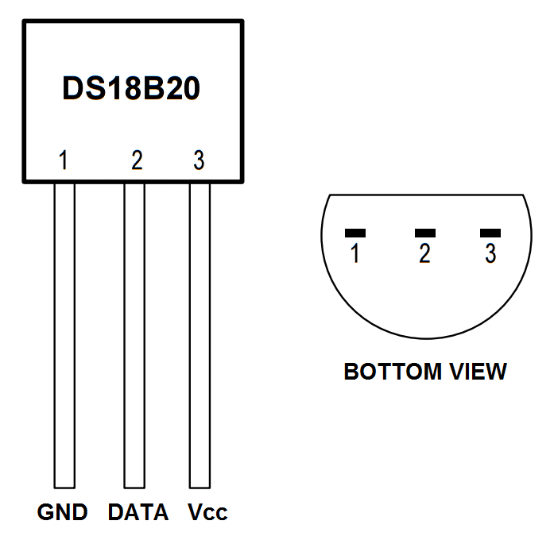

# SMARTHOME NODE
REST API in python and flask which could be installed on a Raspberry Pi. For now the API can read and record the temperature from an one-wire sensor of type DS18B20. In futher version there will be the possibility to control output signals, hence controlling relays for external devices. There is a second repository for a possible UI in react under this link [Smart Home Control UI](https://github.com/VoidMats/SmartHomeControl_UI.git)

### Version
SmartHome node is right now at <br>
__Version 0.0.2__

## FUNCTIONALITIES OF THE API
- Add/Get/Remove sensor that could be used to read the temperature
- Read temperature from temperature sensor
- Record the temperature on each sensor at a certain interval
- Get recorded values from database
- Set a maximum limit of recorded values in database

## TECHNOLOGIES AND DEPENDENCIES
The API uses the following dependencies to implement the API.  
- Sqlite3 
- Python3
- Flask
- Flask_jwt_extended

## API REFERENCE
Smarthome control generally allow HTTP GET/POST/DELETE requests with JSON arguments. The response will always be a JSON response with a field _msg_ for 'Success' or 'Failed' and a second field _data_ for any requestsed info. 

### API endpoints

- /auth/login __[POST]__ <br>
    Login procedure. The response contain a token which should be placed into the header for each request to be authorized for that specific request. <br> 
    _Arguments_:
    - 'username' : username to login 
    - 'password' : password connected to the user
    _Response_:
    - 'msg' : 'Success' or 'Failed'
    - 'data' : auth_token

- /auth/logout __[GET]__ <br>
    Logout from the API. <br> 
    _Response_: <br>
    - 'msg' : 'Success' or 'Failed'

- /temperature/sensor __[POST]__ <br>
    Add a sensor to the API, so it later could be called for temperature. <br> 
    _Arguments_:
    - 'name' : Temperature sensor name. This is what will be visualied in any UI.
    - 'folder' : The unique 64 bits address of the sensor
    - 'position' : The placement of the sensor
    - 'unit' : The temperature unit. Could be either Farenheit [F/f] or Celcius [C/c]
    - 'comment' : Any extra text could be placed here
    _Response_: <br>
    - 'msg' : 'Success' or 'Failed'
    - 'data' : sensor_id
 
- /temperature/sensor __[GET]__ <br>
    Return all registered sensors on the node. <br>
    _Response_: <br>
    - 'msg' : 'Success'/'Failed'
    - 'data' : [(sensor), (sensor), ...]

- /temperature/sensor/<int:sensor_id> __[GET]__ <br>
    Return sensor values from id. <br>
    _Response_: <br>
    - 'msg' : 'Success' or 'Failed'
    - 'data' : [sensor]

- /temperature/sensor/<int:sensor_id> __[DELETE]__ <br>
    Delete sensor from the node. <br>
    _Response_: <br>
    - 'msg' : 'Success' or 'Failed'
    - 'data' : sensor_id

- /temperature/start/<int:intervaltime> __[GET]__ <br>
    Start to record all temperature sensors on the node. The interval between each recording is set in seconds, with a minimum of 5 seconds. The recorded values are stored the in the database. <br>
    _Response_: <br>
    - 'msg' : 'Success' or 'Failed'

- /temperature/stop __[GET]__ <br>
    Stop the recording of the temperature on this node. <br>
    _Response_: <br>
    - 'msg' : 'Success' or 'Failed'

- /temperature/active __[GET]__ <br>
    Is the temperature recording active. <br>
    _Response_: <br>
    - 'msg' : 'Success' or 'Failed'
    - 'data' : bool

- /temperature/read/<int:sensor_id> __[GET]__ <br>
    Return the temperature value from the sensor right now. <br> 
    _Response_: <br>
    - 'msg' : 'Success' or 'Failed' 
    - 'data' : {'sensor': sensor_id, 'temperature': value}

- /temperature __[GET]__ <br>
    Return the temperature values from the database within start date to end date for a specific sensor (sensor_id). <br>
    _Arguments_: <br>
    - 'sensor' : sensor_id as int
    - 'start_date' : date as a string YYYY-mm-dd hh:mm:ss
    - 'end_date' : date as a string YYYY-mm-dd hh:mm:ss
    _Response_: <br>
    - 'msg' : 'Success' or 'Failed'
    - 'data' : [(temperature, timestamp), (temperature, timestamp), ...]

- /temperature/<int:sensor_id> __[DELETE]__ <br>
    Remove all recorded values from the database specific for sensor id. <br> 
    _Response_: <br>
    - 'msg' : 'Success' or 'Failed'
    - 'data' : sensor_id 

## ABOUT DS18B20
The DS18B20 can be operated under what is called parasite power mode. Normally the chip or sensor has three wire; _Vcc_, _ground_ and _data_. Each sensor has an unique 64-bit address which is used to communicate through One-Wire protocol. Nowdays the operating system of a Raspberry Pi have an One-Wire Interface which this project is heavily depends on. The interface has to be enabled before use.

<p align="center">

</p>

### Technical specifications
- -55&deg;C to 125&deg;C range
- 3,0V to 5,0V operating voltage
- 750 ms sampling
- 0,5&deg;C (9 bit), 0,25&deg;C (10 bit), 0,125&deg;C (11 bit), 0,0625&deg; (12 bit) resolution
- One-Wire communication protocol

For more details on configuring parasite power, setting alarm etc please search for a DS18B20 Datasheet.

## SETUP RASPBERRY PI
Before any software could be installed the Raspberry Pi should be prepared with all wiring for one or as many sensors/relays you need. Remember that the power voltage 3,3V goes into pin Vcc on the sensor and ground to the GND pin of the sensor. Finally find a free BCM channel which could be used for data communication (Middle pin of the sensor). The default One-Wire channel is 4, but any channel could be used as long its not configured for something else. Between the power and the data pin there should be a resistor of 4,7K-10K Ohm. See example of a setup BCM4.  


In order to use the DS18B20 sensor it has to be enabled in the operating system. This could be done in the _raspi-config_. But preferably each connected sensor is added to the file _/boot/config.txt_, before rebooting your Pi. By adding following line/s in the bottom of the file each BCM channel will be configured for One-Wire protocol. Please use link for more info - [pinout explained](https://pinout.xyz/pinout/1_wire#)

```linux
dtoverlay=w1-gpio,gpiopin=x
```
If you don't want to use external resistor, you can use a built-in one by typing
```linux
dtoverlay=w1-gpio-pullup,gpiopin=x
```
Ones the raspberry Pi has been rebooted and discover all sensors (devices) they could be listed under the folder _/sys/bus/w1/devices_. It is now possible to see each sensor as a folder with its unique 64-bit address name. Example 28-000006637696. Write down each sensor name because this will be used later for the API.  

```linux
$ ls /sys/bus/w1/devices/
```

It is now possible to read the temperature from a sensor by reading the file w1_slave in each folder. 

```linux
$ cat /28-XXXXXXXXXXXX/w1_slave
```
The result should be something in the form of two lines, where the temperature could be read from variable t=XXXXX. The number has to be divided with 1000. Ex 28625 will become 28,625&deg;C.

```linux
ca 01 4b 46 7f ff 06 10 65 : crc=65 YES
ca 01 4b 46 7f ff 06 10 65 t=28625
```

## INSTALLATION
Before the installed One-wire sensor be recorded the interface be enabled. This is usally easiest done though the raspi-config tool.

```linux
$ sudo raspi-config
```

Select advanced options and 1-Wire. Enable the interface by selecting _Yes_. Check that the module is started with this command. 

```linux
$ lsmod | grep w1
```
The list should contain _w1_therm_, _w1_gpio_ and _wire_. 

Clone the repository to the Raspberry Pi and run the bash file _setup.sh_ in the folder config of the application folder (whatever you call it). Follow the instructions of the script. 

```linux
$ git clone https://github.com/VoidMats/SmartHomeControl_API.git [your folder name]
$ source ./[your folder name]/install.sh
```
## MANUAL INSTALLATION
Instead of running the _setup.sh_ file it possible to install the application manually by running some commands in the terminal through ssh. Some of the commands must be done under _root_ privileges.  
```linux
$ apt-get update
$ apt-get install python3-pip python3-dev
$ apt-get install supervisor
$ python3 -m venv venv
$ source venv/bin/activate
$ pip3 install gunicorn
$ pip3 install flask
$ pip3 install -U flask-cors
$ pip3 install flask-jwt-extended
$ pip3 install requests
```
Change the boot.sh file with port of your choose. Add also the smarthome_node.conf file with two lines.
```linux
directory=[/installed/path/of/repo]
command=/bin/bash [/installed/path/of/repo]/boot.sh
```
Adding new user for the application. 
```linux
$ adduser smarthomenode
$ adduser smarthomenode sudo
$ chown -R smarthomenode:smarthomenode [/installed/path/of/repo]
```
Create a symlink for the smarthome_node.conf file
```linux
ls -s [/installed/path/of/repo]/config/smarthome_node.conf /etc/supervisor/conf.d/smarthome_node.conf
```
Restart supervisor and check that the application is running. 
```linux
$ supervisorctl reread
$ supervisorctl update
$ supervisorctl avail
$ supervisorctl restart
$ supervisorctl status
```

## FURTHER INFORMATION
Using DS18B20 sensor on a Raspberry Pi:
[Raspberry Pi Tutorial Series: 1-Wire DS18B20 Sensor](https://www.waveshare.com/wiki/Raspberry_Pi_Tutorial_Series:_1-Wire_DS18B20_Sensor#Enable_1-Wire)


